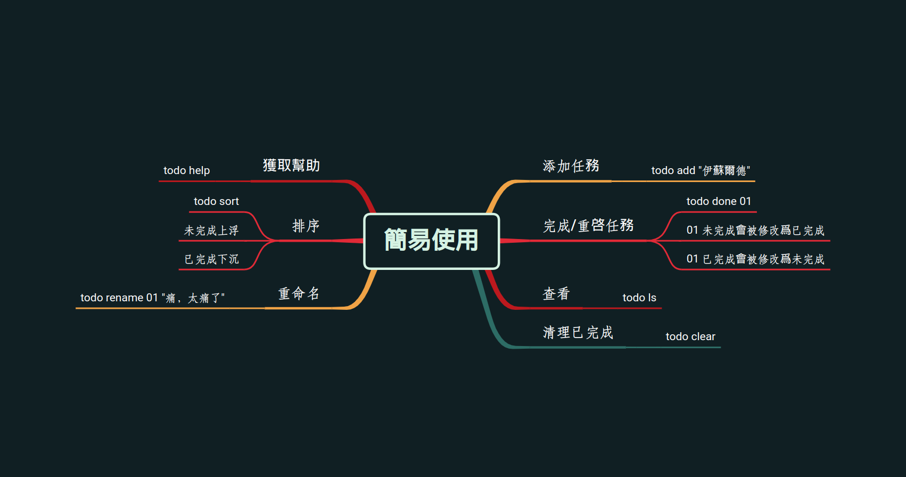

# README

## 這是什麼

一個簡單的在命令行 ToDo List 管理工具（iktodo 完工之前的簡易替代品）。

## 安裝

### go get

```bash
go install github.com/alctny/todo
```

### 編譯安裝

```bash
git clone --depth 1 https://github.com/alctny/todo.git && cd todo && bash install.sh
```

## 使用



## 别名

|子命令|作用|别名|
|--|--|--|
|ls|查看 ToDo 列表|list,show|
|add|添加任務|touch,new,a|
|clear|清理已完成任務|c,cls|
|rename|任務重命名|mv|
|sort|任務排序||
